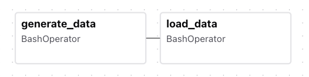

# ETL pipeline testing

This repository contains example pipeline tesing for ETL process that load generated data into Postgres database

---

## Requirements
- Python 3.9+
- docker and docker compose

##  Installation
1. Clone This repository
``` bash
git clone https://github.com/Pongsakorn-Bank/etl-pipeline-test.git
```
2. Enviroment variables (.env) configuration (see example in env.example and replace <YOUR_VALUE> with value that you want) for example
``` bash
# PostgreSQL
POSTGRES_HOST=host.docker.internal
POSTGRES_PORT=5432
POSTGRES_AIRFLOW_DB=airflow
POSTGRES_USER=airflow
POSTGRES_PASSWORD=airflow

# Airflow
_AIRFLOW_WWW_USER_USERNAME=admin
_AIRFLOW_WWW_USER_PASSWORD=admin
_AIRFLOW_WWW_USER_FIRSTNAME=Admin
_AIRFLOW_WWW_USER_LASTNAME=User
_AIRFLOW_WWW_USER_EMAIL=admin@example.com
```

3. Run docker compose
``` bash
docker compos build
docker compose up -d
```

4. Check Postgres DB and Airflow (you should see Adminer database management and Airflow page when call these link in broswer)
``` bash
# Adminer at http://localhost:8081
# Airflow webserver at http://localhost:8080
```

## Execute task with Airflow

In DAGs page you will see 'example_etl_pipeline' DAG installed, this DAG conatin 2 tasks and execute by BashOperator method
1. generate_data (from /data/sampledata.py)
2. load_data (load generated data into Postgres)

<td align="center" style="vertical-align: middle; padding: 10px; border: none; width: 250px;">
  
</td>

### Steps
1. Enter 'example_etl_pipeline' DAG and click Trigger then select 'Single Run' and click 'Trigger'
2. Check task processing

## Reference documents
- Airflow <br>
https://airflow.apache.org/docs/apache-airflow/stable/howto/docker-compose/index.html

- Faster load data into database <br>
https://www.cybertec-postgresql.com/en/bulk-load-performance-in-postgresql/